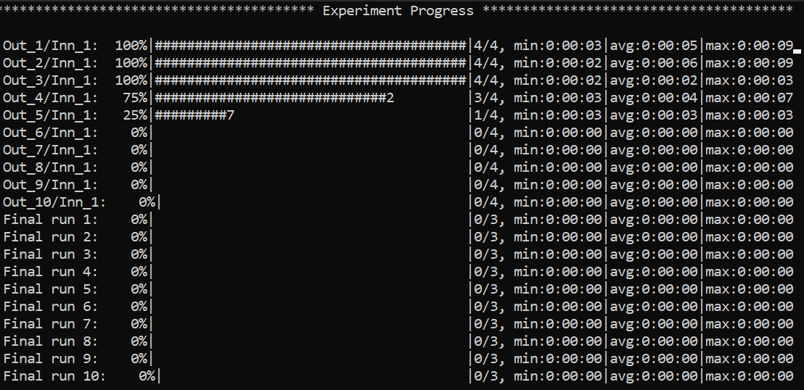
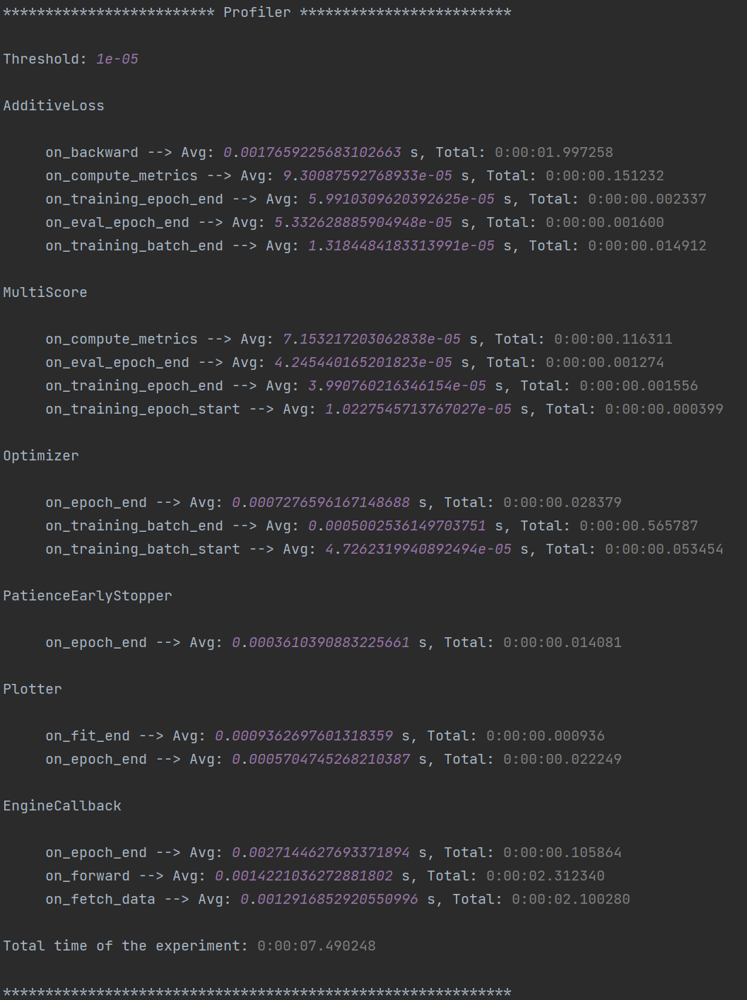
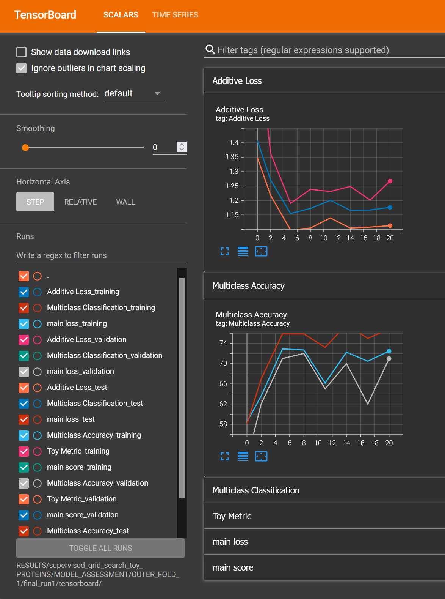

Tutorial
======================
Knowing how to set up valid YAML configuration files is fundamental to properly use **MLWiz**. Custom behavior with
more advanced functionalities can be generally achieved by subclassing the individual modules we provide,
but this is very much dependent on the specific research project.

Data Preprocessing
***********************

The ML pipeline starts with the creation of the dataset and of the data splits. The general template that we can use is
the following, with an explanation of each field as a comment:

.. code-block:: yaml

    splitter:
      splits_folder:  # folder where to store the splits
      class_name:  # dotted path to splitter class
      args:
        n_outer_folds:  # number of outer folds for risk assessment
        n_inner_folds:  # number of inner folds for model selection
        seed:
        stratify:  # target stratification: works for classification tasks only
        shuffle:  # whether to shuffle the indices prior to splitting
        inner_val_ratio:  # percentage of validation for hold-out model selection. this will be ignored when the number of inner folds is > than 1
        outer_val_ratio:  # percentage of validation data to extract for risk assessment final runs
        test_ratio:  # percentage of test to extract for hold-out risk assessment. this will be ignored when the number of outer folds is > than 1
    dataset:
      class_name:  # dotted path to dataset class
      args:  # arguments to pass to the dataset class
        arg_name1:
        arg_namen:
      # pre_transform:  # transform data and store it at dataset creation time. Can be a string or a class + args as below
      transform_train: # on the fly transforms for training data
        - class_name: mlwiz.data.transform.ConstantIfEmpty
          args:
            value: 1
      transform_eval: # on the fly transforms for validation and test data
        - class_name: mlwiz.data.transform.ConstantIfEmpty
          args:
            value: 1

Data Splitting
-------------------

We provide a general :class:`~mlwiz.data.splitter.Splitter` class that is able to split a dataset of multiple samples. The most important parameters
are ``n_outer_folds`` and ``n_inner_folds``, which represent the way in which we want to perform **risk assessment**
and **model selection**. For instance:

 * ``n_outer_folds=10`` and ``n_inner_folds=1``: 10-fold external Cross Validation (CV) on test data, with hold-out model selection inside each of the 10 folds,
 * ``n_outer_folds=5`` and ``n_inner_folds=3``: Nested CV,
 * ``n_outer_folds=1`` and ``n_inner_folds=1``: Simple Hold-out model assessment and selection, or ``train/val/test`` split.

We assume that the difference between **risk assessment** and **model selection** is clear to the reader.
If not, please refer to `Samy Bengio's lecture (Part 3) <https://bengio.abracadoudou.com/lectures/theory.pdf>`_.

Here's an snippet of a potential configuration file that splits a classification dataset:

.. code-block:: yaml

    splitter:
      splits_folder: examples/DATA_SPLITS/
      class_name: mlwiz.data.splitter.Splitter
      args:
        n_outer_folds: 3
        n_inner_folds: 2
        seed: 42
        stratify: True
        shuffle: True
        inner_val_ratio: 0.1
        outer_val_ratio: 0.1
        test_ratio: 0.1

Dataset Creation
-------------------

To create your own dataset, you should implement the :class:`~mlwiz.data.dataset.DatasetInterface` interface.

Here's an snippet of a potential configuration file that downloads and processes the ``MNIST`` classification dataset:

.. code-block:: yaml

    dataset:
      class_name: mlwiz.data.dataset.MNIST
      args:
        storage_folder: DATA/

You can also apply ``transform_train``/``transform_eval`` and ``pre_transform`` to process the samples at runtime or at dataset creation time, respectively.

Once our data configuration file is ready, we can create the dataset using (for the example above)

.. code-block:: bash

    mlwiz-data --config-file examples/DATA_CONFIGS/config_NCI1.yml

Experiment Setup
**********************

Once we have created a dataset and its data splits, it is time to implement our model and define a suitable task.
Every model must implement the :class:`~mlwiz.model.interface.ModelInterface` interface.

At this point, it is time to define the experiment. The general template that we can use is the following, with an
explanation of each field as a comment:

.. code-block:: yaml

    # Dataset and Splits
    storage_folder:  # path to DATA root folder (same as in data config file)
    dataset_class:  # dotted path to dataset class
    data_splits_file:  # path to data splits file

    # Hardware
    device:  # cpu | cuda
    max_cpus:  # > 1 for parallelism
    max_gpus: # > 0 for gpu usage (device must be cuda though)
    gpus_per_task:  # percentage of gpus to allocate for each task
    gpus_subset: # optional, comma-separated list of gpu indices, e.g. 0,2. Used to force a particular subset of GPUs being used.

    # Data Loading
    dataset_getter:  # dotted path to dataset provider class
    data_loader:
      class_name:  # dotted path to data loader class
      args:
        num_workers :
        pin_memory:
        # possibly other arguments (we set `worker_init_fn`, `sampler` and `shuffle`, so do not override)

    # Reproducibility
    seed: 42

    # Experiment
    result_folder:  # path of the folder where to store results
    exp_name:  # name of the experiment
    experiment:  # dotted path to experiment class
    higher_results_are_better:  # model selection: should we select based on max (True) or min (False) main score?
    evaluate_every:  # evaluate on train/val/test every `n` epochs and log results
    risk_assessment_training_runs:  # how many final (model assessment) training runs to perform to mitigate bad initializations
    model_selection_training_runs:  # how many training runs to perform for each hyper-parameter configuration in a specific inner fold

    # Grid Search
    # if only 1 configuration is selected, any inner model selection will be skipped
    grid:
      model:  # dotted path to model class
      checkpoint:  # whether to keep a checkpoint of the last epoch to resume training
      shuffle:  # whether to shuffle the data
      batch_size:  # batch size
      epochs:  # number of maximum training epochs

      # Model specific arguments #

      # TBD by you

      # ------------------------ #

      # Optimizer (with an example - 3 possible alternatives)
      optimizer:
        - class_name: mlwiz.training.callback.optimizer.Optimizer
          args:
            optimizer_class_name: torch.optim.Adam
            lr:
              - 0.01
              - 0.001
            weight_decay: 0.
        - class_name: mlwiz.training.callback.optimizer.Optimizer
          args:
            optimizer_class_name: torch.optim.Adagrad
            lr:
              - 0.1
            weight_decay: 0.

      # Scheduler (optional)
      scheduler: null

      # Loss metric (with an example of Additive Loss)
      loss:
        - class_name: mlwiz.training.callback.metric.AdditiveLoss
          args:
            loss_1: mlwiz.training.callback.metric.MulticlassClassification
            loss_2: mlwiz.training.callback.metric.MulticlassClassification

      # Score metric (with an example of Multi Score)
      scorer:
        - class_name: mlwiz.training.callback.metric.MultiScore
          args:
            main_scorer: mlwiz.training.callback.metric.MulticlassAccuracy
            my_second_metric: mlwiz.training.callback.metric.ToyMetric

      # Training engine
      engine: mlwiz.training.engine.TrainingEngine

      # Gradient clipper (optional)
      gradient_clipper: null

      # Early stopper (optional, with an example of "patience" early stopping on the validation score)
      early_stopper:
        - class_name:
            - mlwiz.training.callback.early_stopping.PatienceEarlyStopper
          args:
            patience:
              - 5
            # SYNTAX: (train_,validation_)[name_of_the_scorer_or_loss_to_monitor] -> we can use MAIN_LOSS or MAIN_SCORE
            monitor: validation_main_score
            mode: max  # is best the `max` or the `min` value we are monitoring?
            checkpoint: True  # store the best checkpoint

      # Plotter of metrics
      plotter: mlwiz.training.callback.plotter.Plotter

Data Information
-----------------

Here we can specify some information about the dataset:

.. code-block:: yaml

    storage_folder: DATA
    dataset_class: mlwiz.data.dataset.MNIST
    data_splits_file:  examples/DATA_SPLITS/MNIST/MNIST_outer3_inner2.splits

Hardware
-----------------

Here we can define how many resources to allocate to parallelize different experiments:

.. code-block:: yaml

    # this will run a maximum of 4 experiments to allocate all of the 2 gpus we have.
    # We use some more cpu resources to take into account potential `data loader workers <https://pytorch.org/docs/stable/data.html#multi-process-data-loading>`_.
    device:  cuda
    max_cpus:  8
    max_gpus: 2
    gpus_per_task:  0.5

Data Loading
-----------------

Here we specify which :class:`~mlwiz.data.provider.DataProvider` we want to use to load the data associated with the
given splits, and the :class:`DataLoader` that needs to handle such data:

.. code-block:: yaml

    # Data Loading
    dataset_getter: mlwiz.data.provider.DataProvider
    data_loader:
      class_name: torch_geometric.loader.DataLoader
      args:
        num_workers : 2
        pin_memory: True  # should be True when device is set to `cuda`

Experiment Details
--------------------

Here we define the experiment details, including the experiment name and type, and the folder where we want to store
our results:

.. code-block:: yaml

    result_folder: RESULTS
    exp_name: mlp
    experiment: mlwiz.experiment.MLP
    higher_results_are_better: True
    evaluate_every: 3
    risk_assessment_training_runs: 3
    model_selection_training_runs: 2

Grid Search
--------------

Grid search is identified by the keyword ``grid`` after the experimental details. This is the easiest setting, in which
you can define lists associated to an hyper-parameter and all possible combinations will be created. You can even have
nesting of these combinations for maximum flexibility.

There is one config file ``examples/MODEL_CONFIGS/config_MLP.yml`` that you can check to get a better idea.

Random Search
--------------

Random search, on the other hand, is identified by the keyword ``random`` after the experimental details. One line above
we have to specify the number of random trials, using the keyword ``num_samples``.

We provide different sampling methods:
 * choice --> pick at random from a list of arguments
 * uniform --> pick uniformly from min and max arguments
 * normal --> sample from normal distribution with mean and std
 * randint --> pick at random from min and max
 * loguniform --> pick following the reciprocal distribution from log_min, log_max, with a specified base

There is one config file ``examples/MODEL_CONFIGS/template_random_search.yml`` that you can check to get a better idea.

Experiment
--------------

Once our experiment configuration file is ready, we can launch an experiment using (see below for a couple of examples)

.. code-block:: bash

    mlwiz-train --config-file examples/MODEL_CONFIGS/config_MLP.yml

or

.. code-block:: bash

    mlwiz-train --config-file examples/MODEL_CONFIGS/config_MLP.yml

And we are up and running!

To stop the computation, use ``CTRL-C`` to send a ``SIGINT`` signal, and consider using the command ``ray stop`` to stop
all Ray processes. **Warning:** ``ray stop`` stops **all** ray processes you have launched, including those of other
experiments in progress, if any.

Some things to notice: because we have chosen a 3-fold CV for risk assessment with a 2-fold CV for model selection **for
each** external fold, you can notice in the picture there are ``3*2`` rows with ``Out_*/Inn_*`` written. For each of these,
we have to perform a model selection with ``4`` possible hyper-parameters' configurations (progress shown on the right handside),
and each model selection experiment is run `model_selection_training_runs` times to mitigate the effect of bad initializations.
In addition, there are also some stats about the time required to complete the experiments.

After the 3 model selection are complete (i.e., one "best" model for each outer/external fold), it is time to re-train
the chosen models on the 3 different train/test splits. Therefore, you can notice ``3`` rows with ``Final run *`` written.
Since we have specified ``risk_assessment_training_runs: 3`` in our exp. config file, we will mitigate unlucky random initializations
of the chosen models by averaging test results (of a single outer fold) over 3 training runs. The final generalization
performances of the model (a less ambiguous definition would be: the **class of models** you developed) is obtained,
for this specific case, as the average of the 10 test scores across the external folds. Again, if this does not make sense
to you, please consider reading `Samy Bengio's lecture (Part 3) <https://bengio.abracadoudou.com/lectures/theory.pdf>`_.

Useful Features to Know About
------------------------------

Disabling Data Splitting Automatic Checks
^^^^^^^^^^^^^^^^^^^^^^^^^^^^^^^^^^^^^^^^^

Since MLWiz 1.2.0, we perform automatic checks that the training/validation/test splits are not overlapping.
This is useful because everytime one implements a new data splitter for their own purposes, bugs may be easily introduced.
If data split overlap is intended in your use case, you can disable the data splits checks by passing the argument
`--skip-data-splits-check` to `mlwiz-data`.

Training vs Inference Data Preprocessing
^^^^^^^^^^^^^^^^^^^^^^^^^^^^^^^^^^^^^^^^

You can specify a separate preprocessing to be applied to the training data vs test data. This is useful, for instance,
when you want to randomly flip training images but you don't want to do it at validation/test time.
You can specify the functions associated with ``transform_train`` and ``transform_eval`` as strings in the dataset's configuration file.
You can find an example above.

Evaluating on test data at every epoch
^^^^^^^^^^^^^^^^^^^^^^^^^^^^^^^^^^^^^^^^

In general, there should not be the need to store test metrics across epochs. That's because everytime we look at test data
we are implicitly affecting our judgement, so it is good practice to evaluate on the test only at the end of risk assessment runs.
This is now the default MLWiz behavior; however, if you want to log test split metrics across epochs, you can specify it
in the ``TrainingEngine`` (in the experiment configuration file) by setting the argument ``eval_test_every_epoch`` to True.

Executing a specific configuration only (debug only!)
^^^^^^^^^^^^^^^^^^^^^^^^^^^^^^^^^^^^^^^^^^^^^^^^^^^^^

When debugging a specific configuration, perhaps because it is crashing unexpectedly,
you can focus on its execution by passing the arguments ``--debug --execute-config-id [config_id]``
to ``mlwiz-train``. Valid IDs start from 1 to the maximum number of configurations tried.
In general, this argument will prioritize the execution of a specific configuration whenever model selection is run for
an outer fold. It cannot be used together with ``--skip-config-ids``.

Skipping a set of configurations
^^^^^^^^^^^^^^^^^^^^^^^^^^^^^^^^

Sometimes, a specific configuration may take a long time to finish training, and you do not want to wait for it.
You can skip its execution during model selection (**note: for all outer folds!**)
by passing the argument ``--skip-config-ids [config_id1] [config_id2] ...``
to ``mlwiz-train``. This will ignore the specified configurations across all outer folds and continue with the remaining
experiments. It cannot be used together with ``-execute-config-id``.

Storing logged metrics on disk
^^^^^^^^^^^^^^^^^^^^^^^^^^^^^^^^^^^

To store epoch-wise metrics computed during training on disk, pass the argument ``store_on_disk: True`` to the ``Plotter``
in the experiment's configuration file. This will produce a PyTorch file called ``metrics_data.torch`` that gets updated
at every epoch. The metrics are stored in a dictionary, with separate keys for losses and scores. I am sure you'll get
around its structure, since I am too lazy to write it here.

Loading and storing graphs
^^^^^^^^^^^^^^^^^^^^^^^^^^

We moved to ``dill`` to save and load in-memory datasets because of some security warnings being issued by Pytorch `save` and `load` methods.
However, using ``dill`` to load and store PyG graphs appears to be extremely inefficient. Because newer versions of PyG
(>=2.6.0) define all the required ``safe_globals``, we decided to continue using ``torch.save`` and ``torch.load`` for graphs.
Whenever you create your own graph dataset by subclassing ``DatasetInterface``, please make sure you override the static methods
``_save_dataset`` and ``_load_dataset`` by calling ``torch.save`` and ``torch.load``, respectively.

Inspecting Results
--------------------

According to our configuration file, the results are stored in the ``RESULTS`` folder. The hierarchy of folder is the following:

.. code-block::

    supervised_grid_search_toy_PROTEINS
    |__ MODEL_ASSESSMENT
        |__ assessment_results.json  # contains the risk assessment results (average of the outer fold results)
        |__ OUTER_FOLD_1
        ...
        |__ OUTER_FOLD_5
            |__ outer_results.json  # contains the aggregated results of the three final runs
            |__ final_run_1
            |__ final_run_2
                |__ tensorboard  # tensorboard folder
                |__ experiment.log  # log file with profiling information
                |__ best_checkpoint.pth  # torch dict holding the "best" checkpoint information according to the early stopper used
                |__ last_checkpoint.pth  # torch dict holding the checkpoint information of the last epoch (top ``checkpoint`` keyword set to true)
                |__ run_2_results.torch  # torch dict holding the results of the 2nd final run on the 5th outer fold.
            |__ final_run_3
            |__ MODEL_SELECTION  # files regarding the model selection inside the 5th outer fold
                |__ winner_config.json  # contains the "best model" across the inner folds (in this case just 1 inner fold) for the 5th fold to be used in the final training runs
                |__ config_1
                |__ config_2
                |__ config_3
                    |__ config_results.json  # contains the aggregated results of the K inner model selection folds
                    |__ INNER_FOLD_1  # first (and only in this case) inner model selection fold
                        |__ run_1
                            |__ tensorboard
                            |__ experiment.log  # log file with profiling information
                            |__ best_checkpoint.pth
                            |__ last_checkpoint.pth
                        |__ run_2
                        |__ fold_1_results.info  # torch dict holding detailed results of the 2 runs of 3rd configuration on 1st inner fold.
                        |__ fold_1_results.torch  # torch dict holding summary results of the 1st fold results of the 3rd configuration, needed to compute config_results.json
                    |__ INNER_FOLD_2
                |__ config_4
        ...
        |__ OUTER_FOLD_10

Profiling Information
-----------------------

Inside each ``experiment.log`` file, you will find training logs and, at the end of each training, the profiler information
with the per-epoch and total time required by each :class:`~mlwiz.training.event.handler.EventHandler`, provided the
time spent is non-negligible (threshold specified in the log file).

Here's what it looks like:

Tensorboard
-----------------------

We can use the generic :class:`~mlwiz.training.callback.plotter.Plotter` class to easily visualize the training trend with
Tensorboard, using the information in the ``tensorboard`` folder:

.. code-block:: bash

    tensorboard --logdir RESULTS/mlp_MNIST/MODEL_ASSESSMENT/OUTER_FOLD_1/final_run1/tensorboard/

And we get:

Filtering Configurations for Post-processing of Results
----------------------------------------------------------

You can use some utilities we provide to focus on a specific set of configurations after your experiments are terminated.
Assuming you run `mlwiz-train --config-file examples/MODEL_CONFIGS/config_MLP.yml` inside the MLWiz repo, you can
then do something like

.. code-block:: python3

    from mlwiz.evaluation.util import retrieve_experiments, filter_experiments

    configs = retrieve_experiments('RESULTS/mlp_MNIST/MODEL_ASSESSMENT/OUTER_FOLD_1/MODEL_SELECTION/')
    print(len(configs))  # will return 32

    filtered_configs = filter_experiments(configs, logic='OR', parameters={'Multiclass Classification': 1, 'lr': 0.001})
    print(len(filtered_configs))  # will return 24

Loading Model for Inspection in a Notebook
----------------------------------------------

We provide utilities to use your model immediately after experiments end to run additional analyses. Here's how:

.. code-block:: python3

    from mlwiz.evaluation.util import *

    config = retrieve_best_configuration('RESULTS/mlp_MNIST/MODEL_ASSESSMENT/OUTER_FOLD_1/MODEL_SELECTION/')
    splits_filepath = 'examples/DATA_SPLITS/MNIST/MNIST_outer3_inner2.splits'
    device = 'cpu'

    # instantiate dataset
    dataset = instantiate_dataset_from_config(config)

    # instantiate model
    model = instantiate_model_from_config(config, dataset, config_type="supervised_config")

    # load model's checkpoint, assuming the best configuration has been loaded
    checkpoint_location = 'RESULTS/mlp_MNIST/MODEL_ASSESSMENT/OUTER_FOLD_1/final_run1/best_checkpoint.pth'
    load_checkpoint(checkpoint_location, model, device=device)

    # you can now call the forward method of your model
    y, embeddings = model(dataset[0])

    # ------------------------------------------------------------------ #
    # OPTIONAL: you can also instantiate a DataProvider to load TR/VL/TE splits specific to each fold

    data_provider = instantiate_data_provider_from_config(config, splits_filepath)
    # select outer fold 1 (indices start from 0)
    data_provider.set_outer_k(0)
    # select inner fold 1 (indices start from 0)
    data_provider.set_inner_k(0)

    # set exp seet for workers (does not affect inference)
    data_provider.set_exp_seed(42)  # any seed

    # load loaders associated with final runs of outer 1 split
    train_loader = data_provider.get_outer_train()
    val_loader = data_provider.get_outer_train()
    test_loader = data_provider.get_outer_train()

    # Please refer to the DataProvider documentation to use it properly.
    # ------------------------------------------------------------------ #

Telegram Bot
-----------------------

Once you have a Telegram bot token and chat id, it is super easy to set up automatic reporting of the main results!
Create a file ``telegram_config.yml`` in the main project folder, and set it up like this:

.. code-block:: yaml

    bot_token: [YOUR TOKEN]
    bot_chat_ID: [YOUR CHAT ID]

    log_model_selection: True  # logs the best config for each outer fold (validation score)
    log_final_runs: True  # logs the outcome of the final runs for each outer fold (test score)

Inside your experiment configuration file (see example in ``examples/MODEL_CONFIGS/config_MLP.yml``), it is sufficient
to specify your telegram configuration file by adding:

.. code-block:: yaml

    # Telegram Bot
    telegram_config_file: telegram_config.yml

And that's all you have to do to start receiving messages when the model selection/final runs for a specific fold end!
You will also receive a message when the experiment terminates with the test score.
