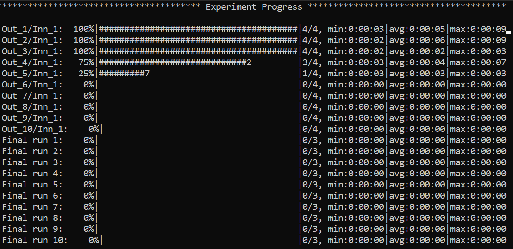
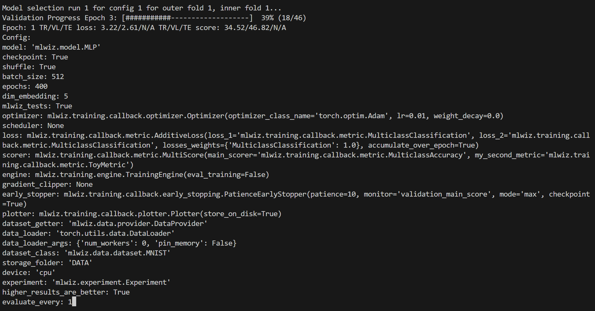
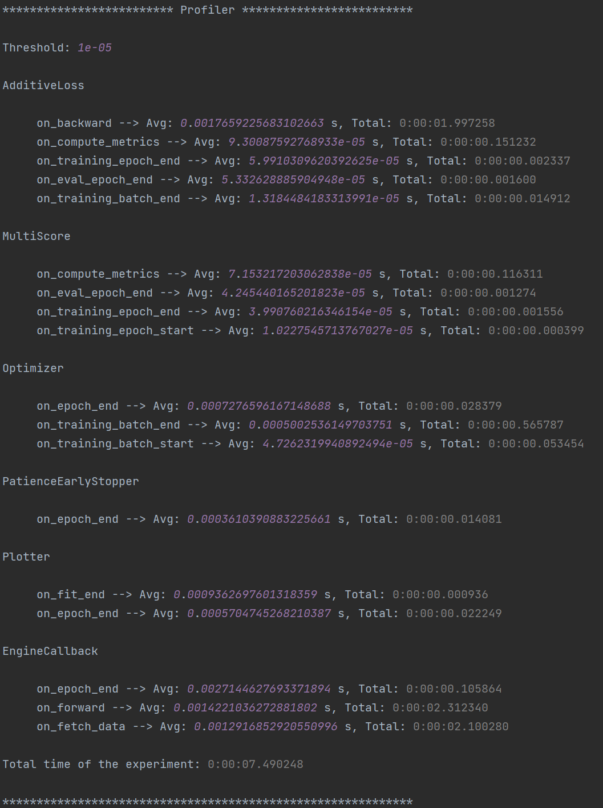

Tutorial
======================
Knowing how to set up valid YAML configuration files is fundamental to properly use **MLWiz**. Custom behavior with
more advanced functionalities can be generally achieved by subclassing the individual modules we provide,
but this is very much dependent on the specific research project.

Data Preprocessing
***********************

The ML pipeline starts with the creation of the dataset and of the data splits. The general template that we can use is
the following, with an explanation of each field as a comment:

.. code-block:: yaml

    splitter:
      splits_folder:  # folder where to store the splits
      class_name:  # dotted path to splitter class
      args:
        n_outer_folds:  # number of outer folds for risk assessment
        n_inner_folds:  # number of inner folds for model selection
        seed:
        stratify:  # target stratification: works for classification tasks only
        shuffle:  # whether to shuffle the indices prior to splitting
        inner_val_ratio:  # percentage of validation for hold-out model selection. this will be ignored when the number of inner folds is > than 1
        outer_val_ratio:  # percentage of validation data to extract for risk assessment final runs
        test_ratio:  # percentage of test to extract for hold-out risk assessment. this will be ignored when the number of outer folds is > than 1
    dataset:
      class_name:  # dotted path to dataset class
      args:  # arguments to pass to the dataset class
        arg_name1:
        arg_namen:
        # Transforms belong inside args. Each can be a dotted path or a class + args mapping.
        # pre_transform: torch.nn.Identity  # transform and store data at dataset creation time
        transform_train:  # on-the-fly transform for training data
          class_name: torchvision.transforms.RandomHorizontalFlip
          args:
            p: 0.5
        transform_eval: torch.nn.Identity  # on-the-fly transform for validation and test data

Data Splitting
-------------------

We provide a general :class:`~mlwiz.data.splitter.Splitter` class that is able to split a dataset of multiple samples. The most important parameters
are ``n_outer_folds`` and ``n_inner_folds``, which represent the way in which we want to perform **risk assessment**
and **model selection**. For instance:

 * ``n_outer_folds=10`` and ``n_inner_folds=1``: 10-fold external Cross Validation (CV) on test data, with hold-out model selection inside each of the 10 folds,
 * ``n_outer_folds=5`` and ``n_inner_folds=3``: Nested CV,
 * ``n_outer_folds=1`` and ``n_inner_folds=1``: Simple Hold-out model assessment and selection, or ``train/val/test`` split.

We assume that the difference between **risk assessment** and **model selection** is clear to the reader.
If not, please refer to `Samy Bengio's lecture (Part 3) <https://bengio.abracadoudou.com/lectures/theory.pdf>`_.

Here's an snippet of a potential configuration file that splits a classification dataset:

.. code-block:: yaml

    splitter:
      splits_folder: examples/DATA_SPLITS/
      class_name: mlwiz.data.splitter.Splitter
      args:
        n_outer_folds: 3
        n_inner_folds: 2
        seed: 42
        stratify: True
        shuffle: True
        inner_val_ratio: 0.1
        outer_val_ratio: 0.1
        test_ratio: 0.1

Dataset Creation
-------------------

To create your own dataset, you should implement the :class:`~mlwiz.data.dataset.DatasetInterface` interface.

Here's an snippet of a potential configuration file that downloads and processes the ``MNIST`` classification dataset:

.. code-block:: yaml

    dataset:
      class_name: mlwiz.data.dataset.MNIST
      args:
        storage_folder: DATA/

You can also apply ``transform_train``/``transform_eval`` and ``pre_transform`` to process the samples at runtime or at dataset creation time, respectively.

Once our data configuration file is ready, we can create the dataset using (for the example above)

.. code-block:: bash

    mlwiz-data --config-file examples/DATA_CONFIGS/config_MNIST.yml

Experiment Setup
**********************

Once we have created a dataset and its data splits, it is time to implement our model and define a suitable task.
Every model must implement the :class:`~mlwiz.model.interface.ModelInterface` interface.

At this point, it is time to define the experiment. The general template that we can use is the following, with an
explanation of each field as a comment:

.. code-block:: yaml

    dataset:
      storage_folder:  # path to DATA root folder (same as in data config file)
      dataset_class:  # dotted path to dataset class
      data_splits_file:  # path to data splits file

    resources:
      device:  # cpu | cuda
      max_cpus:  # > 1 for parallelism
      max_gpus: # > 0 for gpu usage (device must be cuda though)
      gpus_per_task:  # Ray GPUs per task: fraction (<=1) or integer (>1 enables DDP)
      gpus_subset: # optional comma-separated GPU indices, e.g. 0,2
      sync_batchnorm: false  # optionally synchronize BatchNorm statistics in DDP

    data_loading:
      dataset_getter:  # dotted path to dataset provider class
      data_loader:
        class_name:  # dotted path to data loader class
        args:
          num_workers:
          pin_memory:

    reproducibility:
      seed: 42

    experiment:
      result_folder:  # folder where results are stored
      exp_name:  # experiment name
      experiment:  # dotted path to experiment class
      model_selection_criteria:
        - metric: main_score
          direction: max
      evaluate_every:  # evaluate every n epochs
      risk_assessment_training_runs:
      model_selection_training_runs:
      training_timeout_seconds:  # optional; -1 disables

    # Grid Search
    # if only 1 configuration is selected, any inner model selection will be skipped
    grid:
      model:  # dotted path to model class
      checkpoint:  # whether to keep a checkpoint of the last epoch to resume training
      shuffle:  # whether to shuffle the data
      batch_size:  # batch size (global when DDP is enabled, per-process otherwise)
      epochs:  # number of maximum training epochs

      # Model specific arguments #

      # TBD by you

      # ------------------------ #

      # Optimizer (with an example - 3 possible alternatives)
      optimizer:
        - class_name: mlwiz.training.callback.optimizer.Optimizer
          args:
            optimizer_class_name: torch.optim.Adam
            lr:
              - 0.01
              - 0.001
            weight_decay: 0.
        - class_name: mlwiz.training.callback.optimizer.Optimizer
          args:
            optimizer_class_name: torch.optim.Adagrad
            lr:
              - 0.1
            weight_decay: 0.

      # Scheduler (optional)
      scheduler: null

      # Loss metric (with an example of Additive Loss)
      loss:
        - class_name: mlwiz.training.callback.metric.AdditiveLoss
          args:
            loss_1: mlwiz.training.callback.metric.MulticlassClassification
            loss_2: mlwiz.training.callback.metric.MulticlassClassification

      # Score metric (with an example of Multi Score)
      scorer:
        - class_name: mlwiz.training.callback.metric.MultiScore
          args:
            main_scorer: mlwiz.training.callback.metric.MulticlassAccuracy
            my_second_metric: mlwiz.training.callback.metric.ToyMetric

      # Training engine
      engine:
        class_name: mlwiz.training.engine.TrainingEngine
        args:
          eval_training: False  # if True, re-compute train metrics in eval mode every evaluate_every epochs
          mixed_precision: False  # set to True to enable torch AMP autocast (CUDA/CPU)
          mixed_precision_dtype: torch.float16  # torch.float16 | torch.bfloat16

      # Gradient clipper (optional)
      gradient_clipper: null

      # Early stopper (optional, with an example of "patience" early stopping on the validation score)
      early_stopper:
        - class_name:
            - mlwiz.training.callback.early_stopping.PatienceEarlyStopper
          args:
            patience:
              - 5
            # SYNTAX: (train_,validation_)[name_of_the_scorer_or_loss_to_monitor] -> we can use MAIN_LOSS or MAIN_SCORE
            monitor: validation_main_score
            mode: max  # is best the `max` or the `min` value we are monitoring?
            checkpoint: True  # store the best checkpoint

      # Plotter of metrics
      plotter: mlwiz.training.callback.plotter.Plotter

Modular configuration groups
----------------------------

Experiment YAML files have five required global sections: ``dataset``,
``resources``, ``reproducibility``, ``data_loading``, and ``experiment``. They
also have exactly one search section: ``grid``, ``random``, or ``bayes``. Flat
pre-1.7.0 experiment files are rejected; MLWiz deliberately has no legacy
fallback for the old schema.

The configuration files shipped in ``examples/MODEL_CONFIGS`` are examples,
not mandatory templates. You can organize and customize your configuration as
needed. An experiment has the required top-level structure as long as it
contains all five global keys -- ``dataset``, ``resources``,
``reproducibility``, ``data_loading``, and ``experiment`` -- and exactly one of
the search keys ``grid``, ``random``, or ``bayes``. The experiment will then run
provided that the values in those sections, such as referenced classes and
file paths, are valid.

Reusable files are selected through ordered ``defaults`` lists. Root defaults
compose global settings, while a defaults list inside a search section composes
only model-selection settings::

    # MODEL_CONFIGS/config_MLP.yml
    defaults:
      - dataset: mnist
      - resources: cpu
      - reproducibility: default
      - data_loading: torch
      - experiment: default
      - _self_

    experiment:
      exp_name: mlp

    grid:
      defaults:
        - optimizer:
            - adam
            - adagrad
        - search/mlp@_here_
        - _self_
      model: mlwiz.model.MLP
      epochs: 100

Terms and composition rules
^^^^^^^^^^^^^^^^^^^^^^^^^^^

``defaults``
  An ordered list of configuration selections. It instructs MLWiz how to build
  the final dictionary and is removed from that dictionary after composition.

Config group
  A directory containing named alternatives. ``dataset: mnist`` selects
  ``dataset/mnist.yml`` and, by default, packages its contents under
  ``dataset``. ``optimizer: [adam, adagrad]`` selects two files from the same
  group.

``_self_``
  The current file at that exact location in the ordered defaults list. Later
  scalar/list values replace earlier ones and dictionaries merge recursively.
  If omitted, MLWiz implicitly composes ``_self_`` last. An overridden key
  occupies the position of its latest definition in the composed mapping. This
  is observable in grid search: earlier keys form the outer dimensions, while
  the last varying key changes fastest between consecutively numbered
  configurations.

Nested defaults
  A selected config file may have its own root defaults, so reusable fragments
  can be built from smaller fragments. MLWiz resolves these recursively and
  reports cycles. MLWiz also supports a local defaults list directly inside
  ``grid``, ``random``, or ``bayes``; its output stays in that search section.

Package override
  The ``group@package: option`` syntax changes the destination path. For
  example, ``optimizer@training.optimizer: adam`` writes the selected value to
  ``training.optimizer`` instead of ``optimizer``.

``_here_``
  A package used in search-local defaults to merge a selected mapping directly
  into the current search section. In the example, ``search/mlp@_here_`` adds
  sibling ``loss``, ``scorer``, and ``engine`` keys directly to ``grid``.

``_global_``
  A package used from the root defaults list to suppress the normal group
  wrapper and merge a mapping at the root. It is useful when one reusable file
  already contains several complete top-level sections.

Relative and absolute config paths
  Paths are relative to the YAML file containing the defaults list. A leading
  ``/`` resolves from the main configuration directory.

Multiple search configurations
  Each selected optimizer/model/etc. file can contain one mapping or a list of
  alternatives. MLWiz concatenates alternatives from all selected files. Grid
  search expands them all; random and Bayesian search use a categorical choice
  and still resolve samplers nested inside the chosen alternative.

See ``examples/MODEL_CONFIGS/config_MLP.yml`` and the sibling config-group
directories for a complete example.

Data Information
-----------------

Here we can specify some information about the dataset:

.. code-block:: yaml

    dataset:
      storage_folder: DATA
      dataset_class: mlwiz.data.dataset.MNIST
      data_splits_file: examples/DATA_SPLITS/MNIST/MNIST_outer3_inner2.splits

Hardware
-----------------

Here we can define how many resources to allocate to parallelize different experiments:

.. code-block:: yaml

    # this will run a maximum of 4 experiments to allocate all of the 2 gpus we have.
    # We use some more cpu resources to take into account potential `data loader workers <https://pytorch.org/docs/stable/data.html#multi-process-data-loading>`_.
    resources:
      device: cuda
      max_cpus: 8
      max_gpus: 2
      gpus_per_task: 0.5

Practical rule for ``gpus_per_task``:

* ``0 < gpus_per_task < 1``: run more experiments in parallel by assigning a GPU fraction to each task.
* ``gpus_per_task = 1``: single-GPU training per task.
* ``gpus_per_task > 1``: must be an integer; with ``device: cuda`` MLWiz enables **Distributed Data Parallel (DDP)** inside each Ray task.

If you need to force a specific subset of GPUs on a shared machine, use ``gpus_subset``:

.. code-block:: yaml

    resources:
      device: cuda
      max_gpus: 2
      gpus_subset: 0,2
      gpus_per_task: 1

.. code-block:: yaml

    # one experiment uses 2 GPUs with DDP
    # with max_gpus: 4, Ray can run up to 2 such experiments in parallel
    resources:
      device: cuda
      max_cpus: 24
      max_gpus: 4
      gpus_per_task: 2

In DDP mode, MLWiz shards train/validation/test data per rank and then averages scalar evaluation metrics across ranks.
It keeps a single set of experiment artifacts (rank 0 writes logs/checkpoints/plots). If a rank fails, check
``experiment.err`` and ``ddp_rank_0.log``, ``ddp_rank_1.log``, ... inside the run folder.
Also, ``batch_size`` is interpreted as the global batch size and is divided by
``gpus_per_task`` (world size) before building per-rank loaders, so it must be divisible by world size.

Synchronized Batch Normalization
---------------------------------

By default, DDP uses ordinary BatchNorm: its learnable parameters are synchronized through gradient reduction, but
each rank computes batch statistics from its local portion of the batch. To aggregate BatchNorm statistics across all
DDP ranks, enable ``sync_batchnorm`` in the resource configuration:

.. code-block:: yaml

    resources:
      device: cuda
      max_cpus: 24
      max_gpus: 4
      gpus_per_task: 2
      sync_batchnorm: true

MLWiz then converts all PyTorch BatchNorm layers with ``torch.nn.SyncBatchNorm.convert_sync_batchnorm`` before wrapping
the model in DDP. The option defaults to ``false`` because synchronized statistics add communication to each affected
forward pass. It requires active DDP with one CUDA device per process; MLWiz reports a configuration error if it is
enabled for a single-process run or for the model-parallel DDP path.

Automatic Mixed Precision (AMP)
---------------------------------

You can enable AMP from the training engine section:

.. code-block:: yaml

    engine:
      class_name: mlwiz.training.engine.TrainingEngine
      args:
        mixed_precision: True
        mixed_precision_dtype: torch.float16  # torch.float16 | torch.bfloat16

When ``mixed_precision`` is enabled, MLWiz wraps forward/metric computation with ``torch.amp.autocast``.
On CUDA, ``torch.float16`` uses a GradScaler automatically. On CPU, requesting ``torch.float16`` is automatically promoted
to ``torch.bfloat16`` for compatibility. AMP works in both single-GPU and DDP runs, and each rank applies autocast locally.

Data Loading
-----------------

Here we specify which :class:`~mlwiz.data.provider.DataProvider` we want to use to load the data associated with the
given splits, and the :class:`DataLoader` that needs to handle such data:

.. code-block:: yaml

    data_loading:
      dataset_getter: mlwiz.data.provider.DataProvider
      data_loader:
        class_name: torch_geometric.loader.DataLoader
        args:
          num_workers: 2
          pin_memory: True  # should be True when device is set to `cuda`

Experiment Details
--------------------

Here we define the experiment details, including the experiment name and type, and the folder where we want to store
our results:

.. code-block:: yaml

    experiment:
      result_folder: RESULTS
      exp_name: mlp
      experiment: mlwiz.experiment.Experiment
      model_selection_criteria:
        - metric: main_score
          direction: max
      evaluate_every: 3
      risk_assessment_training_runs: 3
      model_selection_training_runs: 2
      training_timeout_seconds: -1

``higher_results_are_better`` is still supported as a legacy shortcut for a
single ``main_score`` criterion, but it cannot be used together with
``model_selection_criteria``.

``model_selection_criteria`` is evaluated in order (lexicographic tie-break).
This lets you define deterministic tie-breaking across multiple metrics:

.. code-block:: yaml

    model_selection_criteria:
      - metric: main_score
        direction: max
      - metric: main_loss
        direction: min
      - metric: ToyMetric
        source: score
        direction: max

For non-main metrics (anything different from ``main_score`` and ``main_loss``),
you must specify ``source`` as either ``score`` or ``loss``.

By default MLWiz will run each training session until either the configured number of epochs is reached or the early
stopper halts it. If you need to cap the wall-clock time of each run, set ``training_timeout_seconds`` to a positive
value. The :class:`~mlwiz.training.engine.TrainingEngine` tracks the elapsed time (including previous attempts when
resuming from checkpoints) and stops scheduling additional epochs once the limit is reached, logging the reason for the
interruption. Keeping checkpointing enabled lets you safely resume from where the timeout was triggered.

``eval_training`` controls how training metrics are reported at evaluation time:
with ``False`` (default), MLWiz reuses training-pass aggregates (faster); with
``True``, it performs an explicit inference pass on the training split
(slower, but directly comparable to validation/test inference mode metrics).

Grid Search
--------------

Grid search is identified by the keyword ``grid`` after the experimental details. This is the easiest setting, in which
you can define lists associated to an hyper-parameter and all possible combinations will be created. You can even have
nesting of these combinations for maximum flexibility.

There is one config file ``examples/MODEL_CONFIGS/config_MLP.yml`` that you can check to get a better idea.
For a multi-GPU DDP setup, refer to ``examples/MODEL_CONFIGS/config_MLP_ddp.yml``.

Random Search
--------------

Random search is identified by ``random``. Its ``budget`` belongs inside the
``random`` section together with the sampled model settings.

We provide different sampling methods:
 * choice --> pick at random from a list of arguments
 * uniform --> pick uniformly from min and max arguments
 * normal --> sample from normal distribution requiring ``mu`` (mean) and ``sigma`` (std)
 * randint --> pick at random from min and max
 * loguniform --> pick following the reciprocal distribution from log_min, log_max, with a specified base

Example (one usage per method):

.. code-block:: yaml

    random:
      budget: 20
      batch_size:  # choice
        sample_method: mlwiz.evaluation.util.choice
        args:
          - 64
          - 128
          - 256
      weight_decay:  # uniform(min, max)
        sample_method: mlwiz.evaluation.util.uniform
        args:
          - 0.0
          - 0.001
      feature_noise_std:  # normal(mu, sigma)
        sample_method: mlwiz.evaluation.util.normal
        args:
          - 0.1   # mu
          - 0.02  # sigma
      num_layers:  # randint(min, max), closed interval [min, max]
        sample_method: mlwiz.evaluation.util.randint
        args:
          - 2
          - 6
      lr:  # loguniform(min, max, [base]); base is optional and defaults to 10
        sample_method: mlwiz.evaluation.util.loguniform
        args:
          - 0.0005
          - 0.05
          - 10

There is one config file ``examples/MODEL_CONFIGS/template_random_search.yml`` that you can check to get a better idea.

Bayesian Search
----------------

Bayesian search is identified by the keyword ``bayes`` after the experimental details.
It uses the same sampled-parameter syntax of random search (``sample_method`` + ``args``),
but configurations are proposed sequentially by Bayesian optimization based on previous results.

Set the optimization budget with ``budget`` and explicitly configure BO
controls with ``random_starts``, ``candidate_pool_size``, and ``ei_xi``.

Minimal skeleton:

.. code-block:: yaml

    bayes:
      budget: 10
      random_starts: 2
      candidate_pool_size: 64
      ei_xi: 0.001
      batch_size:
        sample_method: mlwiz.evaluation.util.choice
        args:
          - 256
          - 512
      optimizer:
        - class_name: mlwiz.training.callback.optimizer.Optimizer
          args:
            optimizer_class_name: torch.optim.Adam
            lr:
              sample_method: mlwiz.evaluation.util.loguniform
              args:
                - 0.0005
                - 0.05

Available ``sample_method`` values are the same as random search:
``choice``, ``uniform``, ``normal``, ``randint``, and ``loguniform``.
Use them as ``mlwiz.evaluation.util.<method>``.

There are two example files you can use as a starting point:
``examples/MODEL_CONFIGS/template_bayes_search.yml`` and
``examples/MODEL_CONFIGS/config_MLP_bayes.yml``.

Hydra-like configuration style
------------------------------

MLWiz uses a lightweight, Hydra-like composition style for experiment
configuration, without requiring Hydra or OmegaConf at runtime. A main YAML
file acts as the entry point, and its ordered ``defaults`` lists select reusable
files from config-group directories such as ``dataset/``, ``resources/``, and
``optimizer/``. This makes it possible to switch a dataset, execution target,
or optimizer by changing a selection instead of copying a complete experiment
file.

The composition directives follow the rules described above: ``_self_``
controls when the current file is merged, ``group@package`` changes the output
location, ``@_here_`` merges a selected mapping into the current search
section, and ``@_global_`` merges it at the configuration root. Relative paths
are resolved from the file declaring the defaults list, while paths beginning
with ``/`` are resolved from the main configuration directory. After
composition, MLWiz works with an ordinary Python dictionary; the ``defaults``
directives do not remain in the final experiment configuration.

Composition examples
^^^^^^^^^^^^^^^^^^^^

The following snippets focus on composition, so unrelated required experiment
sections are omitted for brevity.

Select named files from config groups and use ``_self_`` to control precedence:

.. code-block:: yaml

    defaults:
      - dataset: mnist       # loads dataset/mnist.yml under dataset
      - experiment: default  # loads experiment/default.yml under experiment
      - _self_               # merges this file after both selections

    experiment:
      exp_name: custom_mlp   # overrides/adds to experiment/default.yml

Moving ``_self_`` to the beginning would instead let the selected files
override conflicting values from the main file.

Select several alternatives and merge a shared search fragment in place:

.. code-block:: yaml

    grid:
      defaults:
        - optimizer:
            - adam
            - adagrad
        - search/mlp@_here_
        - _self_
      model: mlwiz.model.MLP
      epochs: 100

Here, the optimizer files become alternatives at ``grid.optimizer``.
``search/mlp@_here_`` contributes keys such as ``loss``, ``scorer``, and
``engine`` directly to ``grid`` instead of creating ``grid.search``.

Use an explicit dotted package when a selection should have a different
destination:

.. code-block:: yaml

    defaults:
      - optimizer@training.optimizer: adam
      - _self_

The contents of ``optimizer/adam.yml`` are placed at
``training.optimizer`` rather than the default ``optimizer`` package.

Use ``@_global_`` when a selected mapping already contains complete top-level
sections. A relative reference starts beside the file declaring it, whereas a
leading ``/`` starts at the main configuration directory:

.. code-block:: yaml

    defaults:
      - fragments/local_sections@_global_  # relative to this YAML file
      - /shared/cluster@_global_            # relative to the config root
      - _self_

Both selected mappings are merged directly into the configuration root without
``fragments`` or ``shared`` wrappers.

Selected files can themselves have defaults. For example,
``models/base.yml`` can reuse ``models/variant/small.yml``:

.. code-block:: yaml

    # models/base.yml
    defaults:
      - variant: small
      - _self_
    activation: relu

.. code-block:: yaml

    # models/variant/small.yml
    width: 64

Selecting ``models: base`` from the main file produces
``models.variant.width: 64`` and ``models.activation: relu``. MLWiz resolves
such nested defaults recursively and reports an error if they form a cycle.

This style is optional: the files under ``examples/MODEL_CONFIGS`` demonstrate
one maintainable organization, not a required directory layout. A composed
experiment only needs the five global sections ``dataset``, ``resources``,
``reproducibility``, ``data_loading``, and ``experiment``, together with exactly
one search section: ``grid``, ``random``, or ``bayes``.

Experiment
--------------

Once our experiment configuration file is ready, we can launch an experiment using (see below for a couple of examples)

.. code-block:: bash

    mlwiz-exp --config-file examples/MODEL_CONFIGS/config_MLP.yml

or

.. code-block:: bash

    mlwiz-exp --config-file examples/MODEL_CONFIGS/config_MLP_ddp.yml

By default, non-debug execution keeps only the global summary view (detailed GUI disabled).
If you want per-run interactive navigation, enable it explicitly:

.. code-block:: bash

    mlwiz-exp --config-file examples/MODEL_CONFIGS/config_MLP.yml --detailed-gui

And we are up and running!

Some things to notice: because we have chosen a 3-fold CV for risk assessment with a 2-fold CV for model selection **for
each** external fold, you can notice in the picture there are ``3*2`` rows with ``Out_*/Inn_*`` written. For each of these,
we have to perform a model selection with ``4`` possible hyper-parameters' configurations (progress shown on the right handside),
and each model selection experiment is run `model_selection_training_runs` times to mitigate the effect of bad initializations.
In addition, there are also some stats about the time required to complete the experiments.

After the 3 model selection are complete (i.e., one "best" model for each outer/external fold), it is time to re-train
the chosen models on the 3 different train/test splits. Therefore, you can notice ``3`` rows with ``Final run *`` written.
Since we have specified ``risk_assessment_training_runs: 3`` in our exp. config file, we will mitigate unlucky random initializations
of the chosen models by averaging test results (of a single outer fold) over 3 training runs. The final generalization
performances of the model (a less ambiguous definition would be: the **class of models** you developed) is obtained,
for this specific case, as the average of the 10 test scores across the external folds. Again, if this does not make sense
to you, please consider reading `Samy Bengio's lecture (Part 3) <https://bengio.abracadoudou.com/lectures/theory.pdf>`_.

Navigating the live progress UI
^^^^^^^^^^^^^^^^^^^^^^^^^^^^^^^

When ``--detailed-gui`` is enabled, the progress screen is interactive. Press ``:`` to open the small prompt in the bottom-right corner, type a command, and
hit ``Enter`` to switch what is rendered without stopping the run. Useful commands:

- ``:`` (or ``:g`` / ``:global``): go back to the default overview with all progress bars.
- ``:r`` (or ``:refresh``): redraw the currently selected view (handy if the terminal layout gets messy).
- ``:<outer> <run>`` (e.g., ``:1 2``): focus the *risk assessment* run number ``run`` of outer fold ``outer`` (numbers start at 1).
- ``:<outer> <inner> <config> <run>`` (e.g., ``:2 1 3 1``): focus a *model selection* run for a specific config inside an outer/inner fold pair.

Global overview (default view):

If an identifier is invalid or the run has not produced updates yet, MLWiz will print a short hint and keep listening so
you can try again.

You can also use the arrow keys:

- **left/right**: move across runs/configurations within the currently selected view.
- **up/down**: toggle between the most recently visited model selection view and risk assessment view.

Focused run view (same as what you see when running with ``--debug``):

To stop the computation, use ``CTRL-C`` to send a ``SIGINT`` signal, and consider using the command ``ray stop`` to stop
all Ray processes. **Warning:** ``ray stop`` stops **all** ray processes you have launched, including those of other
experiments in progress, if any.

Useful Features to Know About
------------------------------

Disabling the detailed GUI
^^^^^^^^^^^^^^^^^^^^^^^^^^

In non-debug mode, detailed GUI updates are disabled by default. This is useful
to keep progress reporting lightweight during long runs.

Use:

.. code-block:: bash

    mlwiz-exp --config-file examples/MODEL_CONFIGS/config_MLP.yml

to keep only the global summary view, or:

.. code-block:: bash

    mlwiz-exp --config-file examples/MODEL_CONFIGS/config_MLP.yml --detailed-gui

to enable focused per-run navigation and updates.

Disabling Data Splitting Automatic Checks
^^^^^^^^^^^^^^^^^^^^^^^^^^^^^^^^^^^^^^^^^

Since MLWiz 1.2.0, we perform automatic checks that the training/validation/test splits are not overlapping.
This is useful because everytime one implements a new data splitter for their own purposes, bugs may be easily introduced.
If data split overlap is intended in your use case, you can disable the data splits checks by passing the argument
`--skip-data-splits-check` to `mlwiz-data`.

Duplicating Same Model Configuration File Across Datasets
^^^^^^^^^^^^^^^^^^^^^^^^^^^^^^^^^^^^^^^^^^^^^^^^^^^^^^^^^

You can duplicate the same model configuration file across datasets by calling
`mlwiz-config-duplicator --base-exp-config <base_exp_config> --data-config-files <data_config_files>"` 
which replaces some keywords in `<base_exp_config>` using information contained in the dataset configuratio files.

The new files have format `<exp_name>_<dataset_name>.yml` and are stored in the current working directory.

Training vs Inference Data Preprocessing
^^^^^^^^^^^^^^^^^^^^^^^^^^^^^^^^^^^^^^^^

You can specify a separate preprocessing to be applied to the training data vs test data. This is useful, for instance,
when you want to randomly flip training images but you don't want to do it at validation/test time.
You can specify the functions associated with ``transform_train`` and ``transform_eval`` as strings in the dataset's configuration file.
You can find an example above.

Evaluating on test data at every epoch
^^^^^^^^^^^^^^^^^^^^^^^^^^^^^^^^^^^^^^^^

In general, there should not be the need to store test metrics across epochs. That's because everytime we look at test data
we are implicitly affecting our judgement, so it is good practice to evaluate on the test only at the end of risk assessment runs.
This is now the default MLWiz behavior; however, if you want to log test split metrics across epochs, you can specify it
in the ``TrainingEngine`` (in the experiment configuration file) by setting the argument ``eval_test_every_epoch`` to True.

Split checkpoint files and optimizer restore
^^^^^^^^^^^^^^^^^^^^^^^^^^^^^^^^^^^^^^^^^^^^

Optimizer checkpoints now include parameter-name metadata (``param_names``) and MLWiz restores optimizer state by
matching parameter names whenever possible, instead of relying only on parameter order.

This is particularly useful in dynamic settings where the module declaration order may change between runs
(for example, enabling/disabling optional blocks, injecting adapters, or refactoring model construction) while parameter
names remain stable. In those cases, momentum/Adam moments are remapped to the correct tensors when resuming from a checkpoint.

For older checkpoints that do not contain ``param_names``, MLWiz falls back to the legacy order-based loading behavior.

Starting with MLWiz 1.7, ``last_checkpoint.pth`` and ``best_checkpoint.pth``
contain the model and run metadata only. Optimizer, scheduler, and AMP scaler
state is saved separately in ``last_optimizer_checkpoint.pth`` and
``best_optimizer_checkpoint.pth``. This lets inference utilities and the
dashboard inspect model weights without deserializing large optimizer tensors.
When a separate optimizer file is absent, resume automatically falls back to
the state embedded in a pre-1.7 model checkpoint.

Executing a specific configuration only (debug only!)
^^^^^^^^^^^^^^^^^^^^^^^^^^^^^^^^^^^^^^^^^^^^^^^^^^^^^

When debugging a specific configuration, perhaps because it is crashing unexpectedly,
you can focus on its execution by passing the arguments ``--debug --execute-config-id [config_id]``
to ``mlwiz-exp``. Valid IDs start from 1 to the maximum number of configurations tried.
In general, this argument will prioritize the execution of a specific configuration whenever model selection is run for
an outer fold. It cannot be used together with ``--skip-config-ids``.

Skipping a set of configurations
^^^^^^^^^^^^^^^^^^^^^^^^^^^^^^^^

Sometimes, a specific configuration may take a long time to finish training, and you do not want to wait for it.
You can skip its execution during model selection (**note: for all outer folds!**)
by passing the argument ``--skip-config-ids [config_id1] [config_id2] ...``
to ``mlwiz-exp``. This will ignore the specified configurations across all outer folds and continue with the remaining
experiments. It cannot be used together with ``--execute-config-id``.

Storing logged metrics on disk
^^^^^^^^^^^^^^^^^^^^^^^^^^^^^^^^^^^

The ``Plotter`` stores epoch-wise metrics for MLWiz Dashboard in a PyTorch file
called ``metrics_data.torch``. Storage is enabled by default and the file is
flushed after every epoch. Set ``store_every_N_epochs`` to a larger positive
integer to reduce the write frequency, or to ``None`` to flush only when
training terminates. Epoch metrics remain under the top-level ``losses`` and
``scores`` keys for compatibility.

Training-step histories are opt-in. Set ``store_every_N_steps`` to a positive
integer to record and flush the current training-batch losses and scores every
``N`` global optimizer steps::

    plotter:
      class_name: mlwiz.training.callback.plotter.Plotter
      args:
        store_every_N_steps: 10

The sampled histories, global step numbers, and Unix timestamps are stored
under the ``step`` key. When that key is present, the run explorer displays an
**Epoch / Step** selector and uses the recorded step numbers on the horizontal
axis. Hovering a sampled point shows its step and local recording time;
aggregate trends show the timestamp range across contributing runs. Artifacts
created before timestamp recording continue to show the step alone. The
default is ``None``, so existing configurations continue to record epoch
histories only. Epoch-level scores still use their configured aggregation rule;
step scores are computed on the sampled training batch.

Step-mode 2D plots draw a dashed vertical marker at every completed epoch.
Hovering a marker shows the epoch ID and the exact step where it was reached;
aggregated plots use the median boundary step across their contributing runs.
For legacy artifacts without ``epoch_last_steps``, the dashboard estimates
uniform boundaries from the number of completed epoch histories and the last
recorded global step, and explicitly labels those marker hovers as estimated.

Every 2D trend supports box zoom: drag a rectangle over the plotting area to
restrict both axes to that region, then repeat to zoom further. **Zoom out**
returns through the selected regions one level at a time. Hover inspection
continues to use only the points visible in the current region.

When step histories are enabled, the exact global step at each completed epoch
is also persisted. If training resumes from an epoch checkpoint, samples from a
later incomplete epoch are removed before that epoch is replayed. The replayed
samples therefore replace the discarded values at the same global step numbers
instead of being appended after them.

Loading and storing graphs
^^^^^^^^^^^^^^^^^^^^^^^^^^

We moved to ``dill`` to save and load in-memory datasets because of some security warnings being issued by Pytorch `save` and `load` methods.
However, using ``dill`` to load and store PyG graphs appears to be extremely inefficient. Because newer versions of PyG
(>=2.6.0) define all the required ``safe_globals``, we decided to continue using ``torch.save`` and ``torch.load`` for graphs.
Whenever you create your own graph dataset by subclassing ``DatasetInterface``, please make sure you override the static methods
``_save_dataset`` and ``_load_dataset`` by calling ``torch.save`` and ``torch.load``, respectively.

Inspecting Results
--------------------

According to our configuration file, the results are stored in the ``RESULTS`` folder. The hierarchy of folder is the following:

.. code-block::

    mlp_MNIST
    |__ MODEL_ASSESSMENT
        |__ assessment_results.json  # contains the risk assessment results (average of the outer fold results)
        |__ OUTER_FOLD_1
        ...
        |__ OUTER_FOLD_5
            |__ outer_results.json  # contains the aggregated results of the three final runs
            |__ final_run_1
            |__ final_run_2
                |__ metrics_data.torch  # epoch-wise losses and scores for MLWiz Dashboard
                |__ experiment.log  # log file with profiling information
                |__ experiment.err  # uncaught exception tracebacks, when a run fails
                |__ best_checkpoint.pth  # torch dict holding the "best" checkpoint information according to the early stopper used
                |__ last_checkpoint.pth  # torch dict holding the checkpoint information of the last epoch (top ``checkpoint`` keyword set to true)
                |__ run_2_results.dill  # dict holding the results of the 2nd final run on the 5th outer fold.
            |__ final_run_3
            |__ MODEL_SELECTION  # files regarding the model selection inside the 5th outer fold
                |__ winner_config.json  # contains the "best model" across the inner folds (in this case just 1 inner fold) for the 5th fold to be used in the final training runs
                |__ config_1
                |__ config_2
                |__ config_3
                    |__ config_results.json  # contains the aggregated results of the K inner model selection folds
                    |__ INNER_FOLD_1  # first (and only in this case) inner model selection fold
                        |__ run_1
                            |__ metrics_data.torch
                            |__ experiment.log  # log file with profiling information
                            |__ experiment.err  # uncaught exception tracebacks, when a run fails
                            |__ best_checkpoint.pth
                            |__ last_checkpoint.pth
                        |__ run_2
                        |__ fold_1_results.info  # torch dict holding detailed results of the 2 runs of 3rd configuration on 1st inner fold.
                        |__ fold_1_results.dill  # dict holding summary results of the 1st fold results of the 3rd configuration, needed to compute config_results.json
                    |__ INNER_FOLD_2
                |__ config_4
        ...
        |__ OUTER_FOLD_10

Profiling Information
-----------------------

Inside each ``experiment.log`` file, you will find training logs and, at the end of each training, the profiler information
with the per-epoch and total time required by each :class:`~mlwiz.training.event.handler.EventHandler`, provided the
time spent is non-negligible (threshold specified in the log file).
If a run crashes with an uncaught exception, the traceback is also appended to ``experiment.err`` in the same run folder.

Here's what it looks like:

MLWiz Dashboard
-----------------------

MLWiz also ships a result browser tailored to its model-selection and risk
assessment hierarchy. Start it from a directory containing your ``RESULTS``
folder:

.. code-block:: bash

    mlwiz-dashboard --logdir RESULTS

Then open the URL printed by the command. The sidebar groups runs by experiment,
outer fold, model-selection configuration, inner fold, and final run. Clicking
a configuration compares the histories from all of its child runs, while
clicking a run focuses on that run only. The dashboard reads
``metrics_data.torch`` written by the
:class:`~mlwiz.training.callback.plotter.Plotter` described above.

The experiment-level configuration filter can compare training or validation
metrics with numeric thresholds, or use **Min** and **Max** to retain the
lowest- or highest-valued configuration in each outer fold. These extrema need
no threshold, retain ties, and update with the latest available values while an
experiment is running.

The run explorer's **Smoothing** slider applies TensorBoard-style,
bias-corrected exponential smoothing to individual and aggregated curves.
Leave it at ``0`` to display only the original values. At higher settings, the
smoothed curve drives the axis, legend, and hover readout while a faint raw
trace preserves short-term spikes. The setting persists for the dashboard
session and generated Python plots contain both the raw and displayed values.

Model Selection Analysis
^^^^^^^^^^^^^^^^^^^^^^^^

The ordinary run browser is useful for inspecting a particular configuration
or run. The separate **Model Selection Analysis** tab answers a different
question: how did recorded quantities behave for each value of a tried
hyperparameter? It reads the live model-selection runs for one experiment,
outer fold, and inner fold, so its plots update as new epochs are flushed to
``metrics_data.torch`` or sampled training steps are recorded.

Choosing the analysis scope
""""""""""""""""""""""""""""""""""""""""

Open **Model Selection Analysis**, then select an **Experiment**, **Outer
fold**, and **Inner fold**. MLWiz recursively flattens each configuration into
dotted leaf names such as ``engine.args.eval_training``. A leaf is offered in
**Group by** only when at least two distinct values occur in the selected fold
pair; a constant setting cannot explain a difference and is therefore hidden.
For a 2D Trend or Metric vs Hyper-Parameter plot, **None — average all runs**
creates one aggregate from every available run in the selected fold pair.
Combined Trends and all 3D views require real grouping parameters, so None is
not offered there. Switching an ungrouped card to 3D automatically selects two
available hyperparameters.

The grouping operation is intentionally marginal. With one selected
hyperparameter, each curve, bar, or distribution averages all available runs
whose configurations share that value, including configurations that differ in
other hyperparameters. Adding a second hyperparameter conditions on the pair of
values, while still averaging over any remaining configuration differences.
Legends, tooltips, and tables report run counts so unequal or still-growing
groups remain visible.

Quantities are discovered from numeric histories in ``metrics_data.torch``.
This includes the standard ``losses`` and ``scores`` groups and suitable custom
data written by a :class:`~mlwiz.training.callback.plotter.Plotter` subclass.
The normalizer accepts:

* one numeric value per epoch;
* nested dictionaries containing numeric epoch histories;
* lists of dictionaries with stable keys across epochs; and
* rectangular numeric matrices shaped as epochs × layers/components (with
  higher-dimensional rectangular values recursively split into components).

Related names ending in ``layer_N`` or ``component_N`` are presented as one
family. Selecting that family creates a separate card for every member for
both Trend and Metric vs Hyper-Parameter analyses. This is useful for widths,
per-layer norms, attention statistics, and similar data where inspecting one
layer at a time would hide the overall behavior.

Adding and managing plots
""""""""""""""""""""""""""""""""""""""""

Choose a plot type and quantity in the controls at the top, then click **Add
plot**. For Trend or Combined Trend plots, **Trend unit** chooses epoch or
sampled training step for the next plot; each resulting card retains its own
**Unit** selector. Adding another plot never replaces the existing plots, even when its
type differs. Every card has independent **Group by** and presentation
controls, an ``×`` button for removal, and an expand/shrink button. Changing a
card's grouping or display mode preserves its position on the page. Plot
definitions, expansion state, and 3D cameras also remain stable across the
dashboard's automatic refreshes.

The available plot types have different aggregation semantics:

**Trend Plots**
  For every value of the selected hyperparameter, MLWiz aligns the recorded
  epochs or sampled global steps and plots their mean with a standard-deviation
  band. Hovering a sampled-step point shows both the global step and the local
  recording-time range for the contributing runs when timestamps are available.
  In 2D, drag a rectangle to zoom both axes; repeated selections form a zoom
  history that can be unwound with **Zoom out**.
  The legend maps
  each line to its hyperparameter value and reports the latest mean ± standard
  deviation and number of contributing runs. Choose **3D** and a **Second
  parameter** to separate curves by a second hyperparameter while retaining
  epoch or step and the recorded quantity as the other axes. The default **2D** view
  remains available. Enable the per-card **Log scale** control to use a
  conventional base-10 logarithmic axis when all displayed values are positive.
  If zero or negative observations or uncertainty-band bounds are present,
  MLWiz automatically falls back to an adaptive symmetric-log axis. Its linear
  region is derived from the displayed magnitudes and limited to six decades
  below the largest magnitude, keeping the behavior independent of the metric's
  units. The
  choice persists with the plot and is included in exported Python code. In
  2D, selecting **None — average all runs** produces one mean curve and
  standard-deviation band from all runs.

**Combined Trends**
  This always-3D view combines two histories recorded with the same unit. Its
  axes are epoch or sampled step, the first quantity, and the second quantity;
  one trajectory is drawn for each
  value of the selected hyperparameter. Compatible multi-layer/component
  families are paired automatically, so related information is rendered
  together rather than hidden behind another selector. Its persistent **Log
  scale** control selects conventional log or adaptive symmetric-log
  independently for each recorded-quantity axis.

**Metric vs Hyper-Parameter**
  This view reduces every run to one value before grouping it. MLWiz first uses
  the metric snapshot stored in ``best_checkpoint.pth``. If that exact metric
  is absent but the checkpoint records its best epoch, the value at that epoch
  is used; otherwise the last finite recorded epoch is used. The resulting run
  values are grouped by hyperparameter value (or value pair), and their mean
  and population standard deviation are displayed. In 2D, Group by None
  instead produces one summary distribution or bar across every run.

  In 2D, **Histogram** draws one mean bar and deviation whisker per
  hyperparameter value. **Violin** displays the run distribution and can
  overlay **Raw points**. With a second hyperparameter, Histogram becomes a 3D
  heatmap-bar grid: the two horizontal axes contain the tried hyperparameter
  values, while bar height and heatmap color both encode the mean metric.
  Missing combinations remain gaps. Violin remains available in 3D. Enable
  **Log scale** to apply the same automatic log/symmetric-log selection
  consistently to bars, heatmap colors, violins, raw points, and their axes.
  Positive, zero, and negative values are all retained. Alternatively, switch the individual plot
  to **Markdown table** to copy exact means, deviations, run counts, and value
  sources.

Exporting reproducible Python code
""""""""""""""""""""""""""""""""""""""""

Every rendered chart in the run browser and Model Selection Analysis has a
**</> Python** button. It opens a dialog containing a standalone Matplotlib
script with the normalized data currently displayed in that chart. Line and
uncertainty-band plots, histograms, violin distributions, 3D heatmap bars, 3D
trends, and combined trajectories are translated to their corresponding
Matplotlib operations rather than exported as a screenshot.

Use the dialog to configure the generated figure:

* choose a conference or journal style from the available ``tueplots`` bundles;
* choose single-column or full-width sizing;
* keep the default Paul Tol muted colorblind-safe palette or select another
  colorblind-safe or ``tueplots`` palette;
* save the reproduced figure as PDF, PNG, SVG, or PGF;
* enable or disable LaTeX text rendering, the grid, title, and legend; and
* review the updated source live, then click **Copy code** or **Download .py**.

The selected export options persist across browser sessions and are reused for
the next plot. LaTeX is disabled by default, so the generated script works
without a TeX installation. If **Use LaTeX text rendering** is enabled, the
machine that runs the script must have a working TeX distribution.

Install the generated script's dependencies with:

.. code-block:: bash

    uv add matplotlib numpy tueplots

Run the downloaded file normally, for example ``python validation_loss.py``.
It writes the figure beside the script in the selected format and opens the
interactive Matplotlib window with ``plt.show()``. Because the normalized plot
data is embedded in the file, reproducing the figure does not require access to
the original ``RESULTS`` directory.

Interacting with 3D plots
""""""""""""""""""""""""""""""""""""""""

Drag a 3D canvas to rotate it and use the mouse wheel to zoom. **Align view X**,
**Y**, or **Z** looks directly along the selected axis; aligning the heatmap-bar
grid with Y gives a compact top-down heatmap, while an oblique or X/Z-aligned
view exposes bar heights. Hover a trend at an epoch or a heatmap/violin mark to
show its hyperparameter values, mean, standard deviation, and contributing run
count. Use the expand button when dense labels or many component plots need
more room.

Recording a family of custom curves
""""""""""""""""""""""""""""""""""""""""

The MLP example includes a deliberately simple
:class:`~mlwiz.training.callback.plotter.WidthPlotter` configuration:

.. code-block:: yaml

    grid:
      # ... model and training settings ...
      plotter:
        - class_name: mlwiz.training.callback.plotter.WidthPlotter
          args:
            store_on_disk: true

``WidthPlotter`` appends one list of layer output widths after each epoch, so
``metrics_data.torch`` contains an ``epochs × layers`` ``model_widths``
matrix. Run the example and open the analysis tab with:

.. code-block:: bash

    mlwiz-exp --config-file examples/MODEL_CONFIGS/config_MLP.yml
    mlwiz-dashboard --logdir RESULTS --open

Select **model widths** once and the dashboard creates one card per layer. A
fixed MLP produces flat width curves; a model that replaces or resizes layers
during training produces changing curves. A custom plotter can expose other
families using the same layout, for example by appending a numeric list to
``self.stored_metrics["layer_norms"]`` at every epoch. Keep the matrix
rectangular across epochs and use ``None`` for an individual missing numeric
observation rather than changing the number of components.

Interpretation notes
""""""""""""""""""""""""""""""""""""""""

The plots describe associations within the tried search space; they do not by
themselves establish that a hyperparameter caused a metric change. In
particular, marginal one-parameter plots average over the other search
dimensions, and live analyses may temporarily contain unequal numbers of runs.
Best-checkpoint comparisons are most meaningful when runs use comparable early
stopping monitors and checkpoint policies. Use the reported group sizes and
the raw-point violin option to inspect variability before choosing a model.

Sharing Dashboard Results with a Peer
^^^^^^^^^^^^^^^^^^^^^^^^^^^^^^^^^^^^^

MLWiz can turn dashboard results into a portable ``.mlwiz`` snapshot. This is
useful when a peer should be able to inspect metric histories, configurations,
filters, and assessment results without receiving your experiment repository or
the complete ``RESULTS`` directory. The recipient only needs a compatible
version of MLWiz installed.

1. Review and export the results
""""""""""""""""""""""""""""""""

Start the normal dashboard and arrange the view you want your peer to see:

.. code-block:: bash

    mlwiz-dashboard --logdir RESULTS --open

The current selection, chart controls, filters, theme, and navigation state are
restored when the peer opens the snapshot. Click **Export all** in the dashboard
header to download ``mlwiz-dashboard-view.mlwiz``. The archive includes every
experiment recognized beneath the dashboard's ``--logdir``; no experiment or
run needs to be selected first.

For a scripted or headless export, run:

.. code-block:: bash

    mlwiz-dashboard-export \
      --logdir RESULTS \
      --output results-for-review.mlwiz

Large result roots can produce large snapshots because all normalized metric
histories are included. To share only one experiment, pass the dashboard path
of any configuration or run in that experiment. The exporter includes the
containing experiment, rather than only that individual run, so the peer can
still compare its configurations and folds:

.. code-block:: bash

    mlwiz-dashboard-export \
      --logdir RESULTS \
      --path mlp_MNIST/MODEL_ASSESSMENT/OUTER_FOLD_1/final_run1 \
      --output mnist-review.mlwiz

Dashboard paths are relative to ``--logdir`` and are shown below the selected
configuration or run in the web interface.

2. Check what will be shared
""""""""""""""""""""""""""""

A ``.mlwiz`` file is a versioned ZIP archive containing one normalized JSON
snapshot. It includes metric histories, configuration and assessment JSON,
configuration-filter values, the experiment/run hierarchy, and browser view
state. It deliberately excludes model and optimizer checkpoints, raw
``metrics_data.torch`` files, Python objects, experiment logs, training data,
operator graphs, and model source code. Consequently, importing it never needs
the sender's custom model classes and does not deserialize Torch or pickle
payloads.

Configuration and assessment metadata can still contain project names,
hyperparameters, paths, or other information from the original result JSON.
Export is therefore not an anonymization step. Before sending the archive, its
JSON can be inspected with standard ZIP tools:

.. code-block:: bash

    unzip -p results-for-review.mlwiz snapshot.json | less

Transfer the resulting ``.mlwiz`` file using the same approved channel you
would use for result tables or other research artifacts.

3. Open the snapshot on the recipient's machine
""""""""""""""""""""""""""""""""""""""""""""""""

After receiving the file, the peer starts an ad-hoc local dashboard server:

.. code-block:: bash

    mlwiz-dashboard-import results-for-review.mlwiz --open

The import command validates the snapshot format, serves only the captured
data, and binds to ``127.0.0.1:6006`` by default. It does not extract an
experiment tree or modify the archive. If port 6006 is occupied, let the
operating system choose a free port:

.. code-block:: bash

    mlwiz-dashboard-import results-for-review.mlwiz --port 0 --open

The peer can navigate, filter, compare plots, and inspect captured JSON just as
in the original dashboard. Model graph inspection is unavailable because
checkpoints are intentionally omitted. Press ``Ctrl-C`` in the terminal to stop
the temporary server.

Snapshots are immutable point-in-time copies. If experiments continue running
or the sender changes the result set, export and share a new ``.mlwiz`` file.

Filtering Configurations for Post-processing of Results
----------------------------------------------------------

You can use some utilities we provide to focus on a specific set of configurations after your experiments are terminated.
Assuming you run `mlwiz-exp --config-file examples/MODEL_CONFIGS/config_MLP.yml` inside the MLWiz repo, you can
then do something like

.. code-block:: python3

    from mlwiz.evaluation.util import retrieve_experiments, filter_experiments

    configs = retrieve_experiments('RESULTS/mlp_MNIST/MODEL_ASSESSMENT/OUTER_FOLD_1/MODEL_SELECTION/')
    print(len(configs))  # returns 20 for the current example configuration

    filtered_configs = filter_experiments(configs, logic='OR', parameters={'Multiclass Classification': 1, 'lr': 0.001})
    print(len(filtered_configs))  # depends on the recorded metric values

Converting Results to a DataFrame for Post-processing
----------------------------------------------------------

Additionally, if you want to convert the list of configurations to a pandas DataFrame, you can use the
``create_dataframe`` utility. This is useful if you want to perform some post-processing of the results, such as

.. code-block:: python3

    configs_df = create_dataframe(config_list=filtered_configs,
                                  key_mappings=[("dim_embedding", int), ("num_layers", int), 
                                                ("lr", float), ("avg_validation_score", float)])

You can specify the type or a function that processes the value of the key in the configuration file, so that it is ready for later plotting for instance.

Exporting Assessment Results to LaTeX
----------------------------------------------------------

When you need a publication-ready table summarizing multiple experiments, rely on the helper located in
``mlwiz/evaluation/util.py``. The function ``create_latex_table_from_assessment_results`` accepts a list of
``(experiment_folder, model_name, dataset_name)`` tuples, reads the aggregated assessment JSON files, and formats them
as a LaTeX table that already includes the corresponding standard deviations.

.. code-block:: python3

    from mlwiz.evaluation.util import create_latex_table_from_assessment_results

    experiments = [
        ("RESULTS/mlp_MNIST", "MLP", "MNIST"),
        ("RESULTS/dgn_PROTEINS", "DGN", "PROTEINS"),
    ]

    latex_table = create_latex_table_from_assessment_results(
        experiments,
        metric_key="main_score",
        no_decimals=3,
        model_as_row=True,
        use_single_outer_fold=False,
    )

    print(latex_table)

You can change ``metric_key`` to any metric stored in the assessment files, customize the rounding through
``no_decimals``, and decide whether models or datasets are rendered as rows with ``model_as_row``. Setting
``use_single_outer_fold=True`` is handy when the experiment only used a single outer fold and you still want the final
runs' standard deviation to be reported in the LaTeX output.

Comparing Statistical Significance Between Models
----------------------------------------------------------

When you need to quantify whether a highlighted model is statistically better than others, use the helper
``statistical_significance``. It automatically chooses the right samples: if multiple outer folds are present,
it uses the outer-fold averages; otherwise it falls back to the final runs of the single outer fold. A Welch t-test
is applied with a 95% confidence level by default.

.. code-block:: python3

    from mlwiz.evaluation.util import statistical_significance

    reference = ("RESULTS/mlp_MNIST", "MLP", "MNIST")
    competitors = [
        ("RESULTS/baseline1_MNIST", "B1", "MNIST"),
        ("RESULTS/baseline2_MNIST", "B2", "MNIST"),
    ]

    df = statistical_significance(
        highlighted_exp_metadata=reference,
        other_exp_metadata=competitors,
        metric_key="main_score",
        set_key="test",
        confidence_level=0.95,
    )

    print(df)

The resulting DataFrame includes mean/std/CI for the reference and each competitor, the sample source (outer fold means
or final runs), the p-value of the two-sided test, and a boolean flag indicating if the difference is significant at the
requested confidence level.

Loading Model for Inspection in a Notebook
----------------------------------------------

We provide utilities to use your model immediately after experiments end to run additional analyses. Here's how:

.. code-block:: python3

    from mlwiz.evaluation.util import *

    config = retrieve_best_configuration('RESULTS/mlp_MNIST/MODEL_ASSESSMENT/OUTER_FOLD_1/MODEL_SELECTION/')
    splits_filepath = 'examples/DATA_SPLITS/MNIST/MNIST_outer3_inner2.splits'
    device = 'cpu'

    # instantiate dataset
    dataset = instantiate_dataset_from_config(config)

    # instantiate model
    model = instantiate_model_from_config(config, dataset)

    # load model's checkpoint, assuming the best configuration has been loaded
    checkpoint_location = 'RESULTS/mlp_MNIST/MODEL_ASSESSMENT/OUTER_FOLD_1/final_run1/best_checkpoint.pth'
    load_checkpoint(checkpoint_location, model, device=device)

    # you can now call the forward method of your model
    y, embeddings = model(dataset[0])

    # ------------------------------------------------------------------ #
    # OPTIONAL: you can also instantiate a DataProvider to load TR/VL/TE splits specific to each fold

    data_provider = instantiate_data_provider_from_config(
        config,
        splits_filepath,
        n_outer_folds=3,
        n_inner_folds=2,
    )
    # select outer fold 1 (indices start from 0)
    data_provider.set_outer_k(0)
    # select inner fold 1 (indices start from 0)
    data_provider.set_inner_k(0)

    # set exp seet for workers (does not affect inference)
    data_provider.set_exp_seed(42)  # any seed

    # load loaders associated with final runs of outer 1 split
    train_loader = data_provider.get_outer_train()
    val_loader = data_provider.get_outer_val()
    test_loader = data_provider.get_outer_test()

    # Please refer to the DataProvider documentation to use it properly.
    # ------------------------------------------------------------------ #

Telegram Bot
-----------------------

Once you have a Telegram bot token and chat id, it is super easy to set up automatic reporting of the main results!
Create a file ``telegram_config.yml`` in the main project folder, and set it up like this:

.. code-block:: yaml

    bot_token: [YOUR TOKEN]
    bot_chat_ID: [YOUR CHAT ID]

    log_model_selection: True  # logs the best config for each outer fold (validation score)
    log_final_runs: True  # logs the outcome of the final runs for each outer fold (test score)

Inside your experiment configuration file (see example in ``examples/MODEL_CONFIGS/config_MLP.yml``), it is sufficient
to specify your telegram configuration file by adding:

.. code-block:: yaml

    # Telegram Bot
    telegram_config_file: telegram_config.yml

And that's all you have to do to start receiving messages when the model selection/final runs for a specific fold end!
You will also receive a message when the experiment terminates with the test score.
